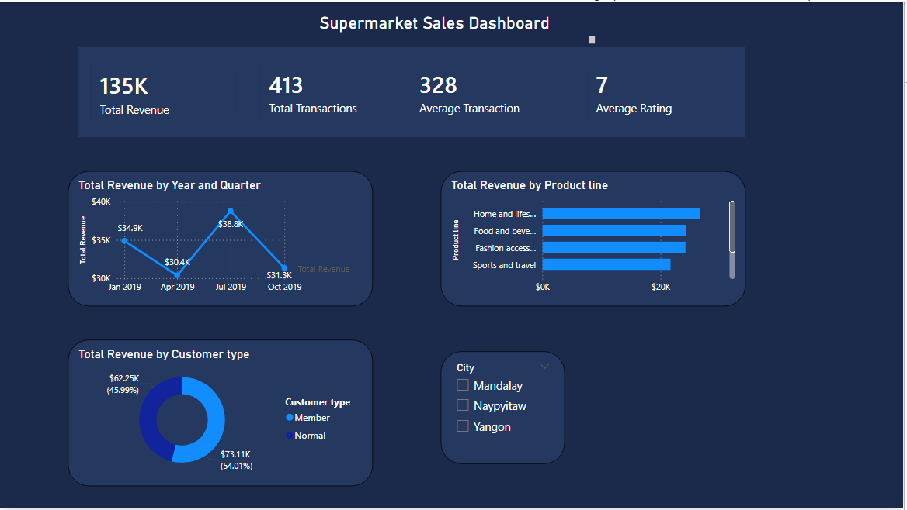

# powerbi-portfolio
Power BI dashboards and data analysis projects

## Project 1: Supermarket Sales Dashboard

**question to cover:** How do sales perform across cities, 
product lines, and customer segments?

**Dataset:** 1,000+ supermarket transactions — revenue, 
ratings, product categories, customer types (used an opensource data set)

**Dashboard includes:**
- KPI cards: Total Revenue, Total Transactions, Average 
  Rating, Average Transaction Value
- Revenue trend over time (line chart by year/quarter/month)
- Revenue by Product Line (bar chart)
- Revenue by Customer Type (donut chart)
- City filter (slicer) for interactive analysis

**Skills:** DAX measures, date hierarchy, 
slicers, card visuals, chart formatting

**Tools:** Power BI Desktop
